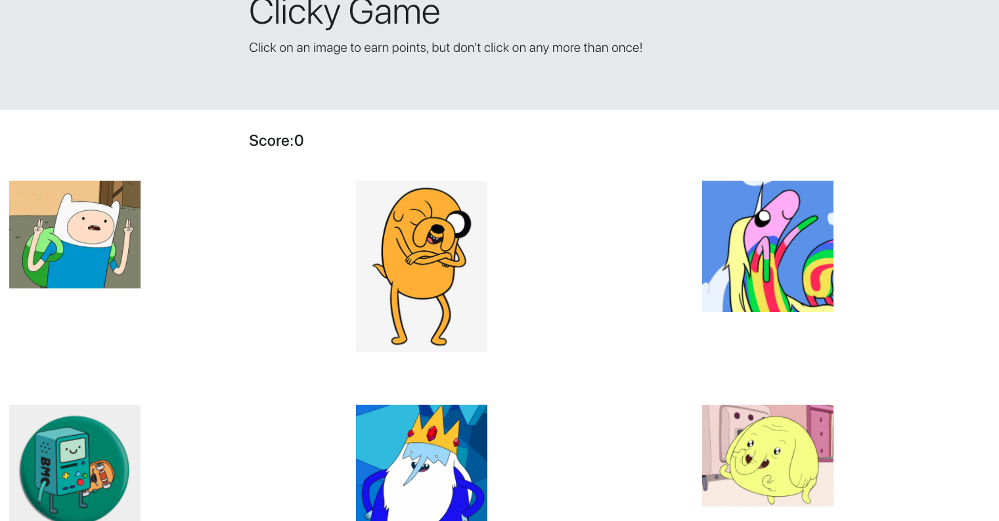

# Clicky game
[React is an open-source JavaScript library for building user interfaces or UI components. It is maintained by Facebook and a community of individual developers and companies. React can be used as a base in the development of single-page or mobile applications.](https://en.wikipedia.org/wiki/React_(web_framework)) Here we are using react to create a memory game that challenges our state management abilities to generate conditions on which the game functions. 

# Site picture

# Technologies used
* React.js
* HTML
* CSS
* Javascript
* Bootstrap

# Acknowledgements
* Wikipedia
* React Deploy example

# Deployed Link
* [Github Repo](https://github.com/Kionling/clickgame2)
* [Deployed Site](https://kionling.github.io/clickgame2/)

